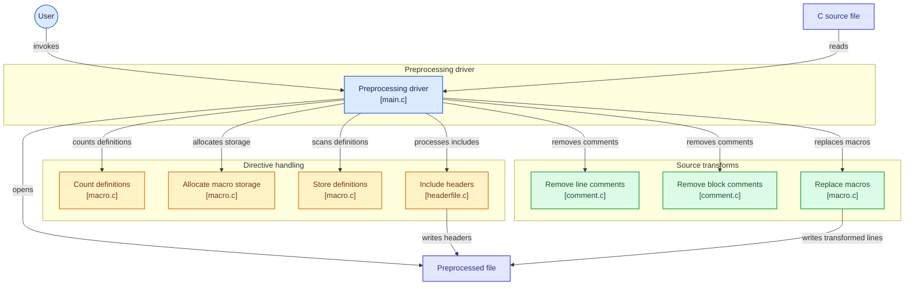

<div align="center">

# ⚙️ C Preprocessor

**A lightweight C preprocessor written in C, from scratch.**

Strips comments, expands macros, and resolves `#include` directives, producing a clean, preprocessed source file.


</div>

---

## ✨ Features

| Feature | Description | Module |
|---|---|---|
| 🧹 **Line comment removal** | Strips `// ...` comments | `comment.c` |
| 🧹 **Block comment removal** | Strips `/* ... */` comments | `comment.c` |
| 🔁 **Macro replacement** | Expands `#define` macros throughout the source | `macro.c` |
| 📊 **Definition counting** | Counts macro definitions up front | `macro.c` |
| 🧠 **Macro storage** | Allocates memory and stores parsed definitions | `macro.c` |
| 📎 **Header inclusion** | Processes `#include` and writes headers to output | `headerfile.c` |

---

## 🏗️ Architecture

`main.c` acts as the driver. It reads the C source file, delegates work to the directive-handling and source-transform modules, and writes everything to the preprocessed output file.



> 💡 **Tip:** on GitHub, each box in the diagram links straight to its source file.

### Color legend

| Color | Meaning |
|---|---|
| 🟦 Blue | Entry point: the user and the driver |
| 🟨 Amber | Directive handling (`#define`, `#include`) |
| 🟩 Green | Source transforms (comments, macro expansion) |
| 🟪 Indigo | Input and output files |

---

## 🔄 How It Works

1. **Invoke**: the user runs the preprocessor from the command line.
2. **Read**: `main.c` opens the C source file and creates the output file.
3. **Scan directives**: `macro.c` counts `#define` entries, allocates storage, and stores each definition.
4. **Process includes**: `headerfile.c` resolves `#include` directives and writes header contents to the output.
5. **Transform source**: `comment.c` removes line and block comments, then `macro.c` replaces macros in the remaining code.
6. **Write**: the transformed lines land in the preprocessed file.

---

## 📁 Project Structure

```
preprocessor/
├── main.c         # Driver: orchestrates the whole pipeline
├── macro.c        # Macro counting, storage, parsing and replacement
├── comment.c      # Line (//) and block (/* */) comment removal
├── headerfile.c   # #include handling
└── README.md
```

---

## 🚀 Getting Started

### Prerequisites

- A C compiler such as `gcc` or `clang`
- `make` (optional)

### Build

```bash
git clone https://github.com/syampullamar/preprocessor.git
cd preprocessor
gcc -Wall -Wextra -o preprocessor main.c macro.c comment.c headerfile.c
```

### Run

```bash
./preprocessor input.c output.c
```

---

## 🧪 Example

**Input** (`input.c`)

```c
#define PI 3.14159
#define SQUARE(x) ((x) * (x))

/* Compute the area of a circle */
float area(float r) {
    return PI * SQUARE(r); // area = πr²
}
```

**Output** (`output.c`)

```c
float area(float r) {
    return 3.14159 * ((r) * (r));
}
```

---

## 🗺️ Roadmap

- [ ] Conditional compilation (`#ifdef`, `#ifndef`, `#else`, `#endif`)
- [ ] Function-like macro argument handling edge cases
- [ ] `#undef` support
- [ ] Better error messages with line numbers
- [ ] Unit tests

---

## 🤝 Contributing

Contributions, issues, and feature requests are welcome!

1. Fork the repository
2. Create your branch: `git checkout -b feature/my-feature`
3. Commit your changes: `git commit -m "Add my feature"`
4. Push and open a Pull Request

---

## 📄 License

Distributed under the MIT License. See `LICENSE` for details.

---

<div align="center">

**Built by [Syam Prasad Pullamar](https://github.com/syampullamar)**

If you found this useful, consider giving it a ⭐

</div>
